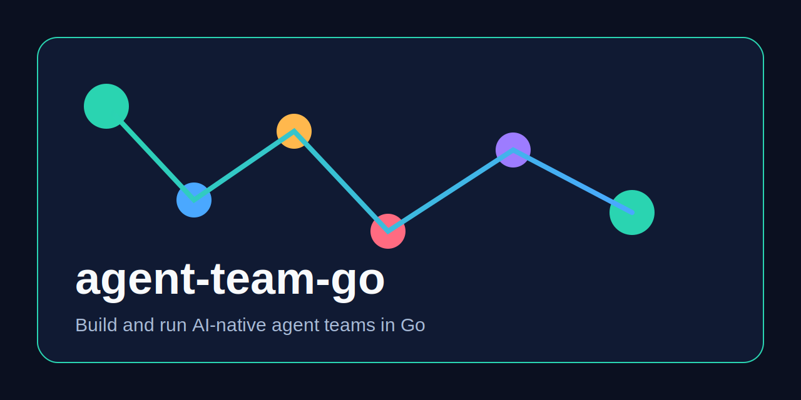
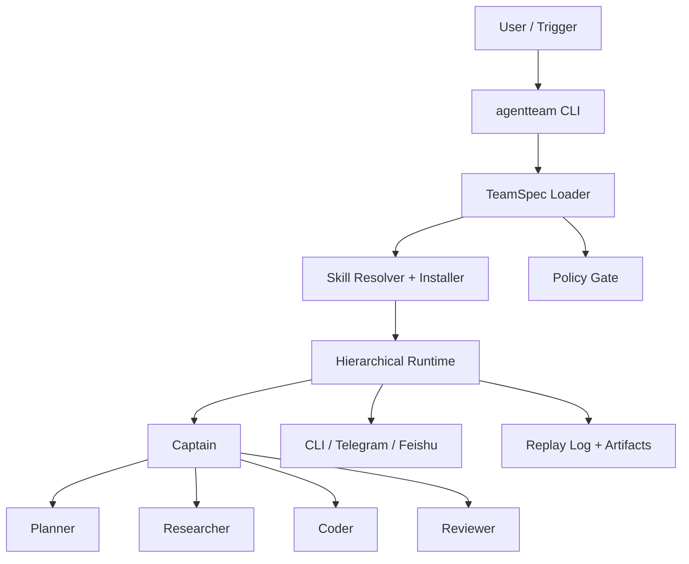

# agent-team-go

[](https://github.com/daewoochen/agent-team-go/actions/workflows/ci.yml)
[](./LICENSE)
[](./go.mod)
[](https://github.com/daewoochen/agent-team-go/stargazers)

Build and run AI-native agent teams in Go.

`agent-team-go` is a Go-first platform skeleton for teams of agents that can coordinate work, install the skills they need, and connect to real delivery channels like Feishu and Telegram.



[Chinese docs](./docs/zh-cn/README.md) · [Contributing](./CONTRIBUTING.md) · [Security](./SECURITY.md)

## Why this exists

Most agent frameworks stop at orchestration demos. Production teams need more:

- Structured delegation instead of prompt-only handoffs
- Custom skills with auto-install from local, registry, or git sources
- Channel adapters for Feishu, Telegram, and CLI-first workflows
- Replayable runs, artifacts, and event logs
- A clean Go codebase that is simple to deploy and extend

This repository is the first public release of that direction.

## Core promises

- `Custom Skills`: define your own skill packages and keep them versioned
- `Auto Skill Install`: missing skills are resolved and installed before a run
- `Feishu / Telegram Gateway`: channel adapters are first-class, not an afterthought
- `Structured Delegation`: captain, planner, researcher, coder, reviewer all work through typed work items
- `Replay Logs`: every run emits events and artifacts that can be replayed later
- `Checkpoints + Approvals`: runs persist checkpoints and approval events for safer execution
- `Team Memory`: compact history from earlier runs feeds into future planning and synthesis
- `Model Bindings`: each agent can declare its own model while providers are configured once at the team level
- `Retry-Aware Execution`: work items can retry and surface blocked dependencies instead of failing silently
- `Channel Delivery Previews`: enabled channels produce delivery payload previews before you wire real bots
- `Pause / Resume`: manual approval mode can pause a run, persist state, and resume after a human decision

## Quick start

### 1. Run the example

```bash
git clone git@github.com:daewoochen/agent-team-go.git
cd agent-team-go
go run ./cmd/agentteam run \
  --team ./examples/software-team/team.yaml \
  --task "Launch the public MVP and de-risk the first release"
```

### 2. Validate channels

```bash
go run ./cmd/agentteam channels validate --team ./examples/software-team/team.yaml
```

### 3. Install a skill manually

```bash
go run ./cmd/agentteam skills install \
  --name github \
  --source local \
  --path ./skills/github
```

### 4. Scaffold a custom skill

```bash
go run ./cmd/agentteam skills scaffold \
  --name launch-writer \
  --dir ./skills/launch-writer \
  --description "Draft release-ready launch notes"
```

### 5. Browse the skill catalog

```bash
go run ./cmd/agentteam skills search --query messenger
go run ./cmd/agentteam skills list --workdir .
```

### 6. Bootstrap your own team

```bash
go run ./cmd/agentteam init --name my-team --dir ./demo
```

### 7. Explain model setup

```bash
go run ./cmd/agentteam models explain --team ./examples/software-team/team.yaml
```

### 8. Inspect the team topology

```bash
go run ./cmd/agentteam inspect team --team ./examples/software-team/team.yaml
go run ./cmd/agentteam inspect team --team ./examples/software-team/team.yaml --format mermaid
```

### 9. Inspect a replay

```bash
go run ./cmd/agentteam replay show --run ./.agentteam/runs/<run-id>.json
```

### 10. Inspect persistent team memory

```bash
go run ./cmd/agentteam memory show --team ./examples/software-team/team.yaml
```

### 11. Pause for approval and resume

```bash
go run ./cmd/agentteam run \
  --team ./examples/manual-approval-team/team.yaml \
  --task "Prepare the launch response and guarded rollout plan"

go run ./cmd/agentteam approvals show --checkpoint ./.agentteam/checkpoints/<run-id>.json
go run ./cmd/agentteam approvals approve --checkpoint ./.agentteam/checkpoints/<run-id>.json --all
go run ./cmd/agentteam resume --team ./examples/manual-approval-team/team.yaml --checkpoint ./.agentteam/checkpoints/<run-id>.json
```

If the operator wants to stop the run instead of continuing:

```bash
go run ./cmd/agentteam approvals reject \
  --checkpoint ./.agentteam/checkpoints/<run-id>.json \
  --id approval-outbound-message \
  --note "Need a safer rollout and external review first"
```

## What the MVP already does

- Parses a declarative `team.yaml`
- Validates channel configuration
- Validates model provider configuration and API key env bindings
- Ensures required skills are installed before a run
- Runs a hierarchical team loop with structured delegations, retries, and dependency-aware scheduling
- Produces work items, approvals, artifacts, checkpoints, replay logs, compact team memory, channel delivery previews, and resumable paused runs

## Persistent team memory

Agent teams should not lose every lesson after a run finishes.

Enable file-backed memory in `team.yaml`:

```yaml
memory:
  backend: file
  path: .agentteam/memory/release-history.json
  max_entries: 8
```

Then inspect it:

```bash
go run ./cmd/agentteam memory show --team ./examples/release-memory-team/team.yaml
```

This is useful for recurring cases such as release management, incident follow-up, customer support triage, and weekly research programs.

## Configure model API keys

Model providers live under `models.providers` in `team.yaml`. The recommended pattern is:

1. Put the real secret in an environment variable
2. Reference that variable with `api_key_env`
3. Point each agent at a model like `openai/gpt-4.1-mini`

Example:

```yaml
models:
  default_model: openai/gpt-4.1-mini
  providers:
    openai:
      kind: openai-compatible
      base_url: https://api.openai.com/v1
      api_key_env: OPENAI_API_KEY

agents:
  - name: captain
    role: captain
    model: openai/gpt-4.1
```

Then export the key before you run the team:

```bash
export OPENAI_API_KEY=your_api_key
go run ./cmd/agentteam models validate --team ./team.yaml
```

`agentteam` will also auto-load a `.env` file from the current working directory and the team spec directory when present. The repo ships an [.env.example](./.env.example) file with common variable names.

## Example architecture



## Typical launch-worthy scenarios

1. `Software Team`
   Captain coordinates Planner, Researcher, Coder, and Reviewer to ship a feature or release.
2. `Assistant Team`
   Coordinator receives incoming requests, routes them to specialists, and reports progress back to Feishu or Telegram.
3. `Ops Team`
   A captain agent validates channel access, installs missing skills, and assembles a safe execution plan.
4. `Manual Approval Team`
   A run pauses for human approval before protected actions, then resumes from checkpoint.
5. `Deep Research Team`
   Researcher and Reviewer build a fact package while the captain prepares a final synthesis.
6. `Incident Response Team`
   Captain coordinates evidence gathering and approval-aware stakeholder updates.
7. `Content Studio Team`
   A small team plans, drafts, and reviews launch assets using reusable skills.
8. `Release Memory Team`
   A recurring release team remembers prior risks, decisions, and follow-up tasks across runs.

More example specs live in [examples/README.md](./examples/README.md).
If you want a real provider example, start from [examples/openai-launch-team/team.yaml](./examples/openai-launch-team/team.yaml).

## Why Go

- Single binary distribution
- Strong typing for specs, work items, and delegation contracts
- Great fit for concurrent run orchestration
- Friendly to platform teams that want predictable operations

## Why not another agent framework

This repo is intentionally opinionated:

- It starts from team execution, not just model orchestration
- It treats skills and channels as platform primitives
- It keeps the code small enough to learn, fork, and ship

## Roadmap

- `v0.1`: CLI, TeamSpec, skill resolver, local runtime, CLI channel
- `v0.2`: richer Telegram and Feishu adapters, stronger policy hooks
- `v0.3`: MCP bridge, better artifact handling, richer replay visualization
- `v0.4`: A2A bridge, sandbox execution, web console

## Repo layout

```text
cmd/agentteam          # CLI entrypoint
pkg/spec               # TeamSpec, AgentSpec, SkillManifest, channel config
pkg/runtime            # Run loop, delegation events, replay model
pkg/skills             # Skill resolver, installer, registry placeholder
pkg/channels           # CLI / Telegram / Feishu adapters
pkg/agents             # Role helpers
pkg/policy             # Download / install policy hooks
pkg/observe            # Replay log writer
examples/              # Runnable team templates
skills/                # Bundled skills
docs/                  # Extra documentation
```

## New in this iteration

- Team-level model provider config with per-agent model selection
- real `openai-compatible` provider support alongside deterministic mock providers
- `agentteam models explain` and `agentteam models validate`
- `agentteam skills scaffold`, `skills search`, and `skills list`
- `agentteam inspect team --format text|mermaid`
- retry-aware work items with blocked-dependency events
- prepared channel delivery previews in run output and replay logs
- manual approval mode with checkpoint-backed `approvals show/approve` and `resume`
- approval rejection and operator notes that flow back into resumed runs
- replay inspection via `agentteam replay show`
- persistent team memory with `agentteam memory show`
- checkpoint persistence under `.agentteam/checkpoints/`
- richer example cases for research, incident response, and content teams

## Current status

This is a polished MVP skeleton. It is meant to be runnable, readable, and easy to extend. The next step after the initial launch is to replace placeholder integrations with full production adapters while keeping the public interfaces stable.

## Contributing

Issues and pull requests are welcome. Good first contributions:

- richer skill manifests
- more realistic delegation strategies
- deeper Telegram / Feishu validation
- replay visualizers
- MCP and sandbox integrations

If this direction resonates with you, give the repo a star and share it with one builder who is tired of fragile agent demos.
