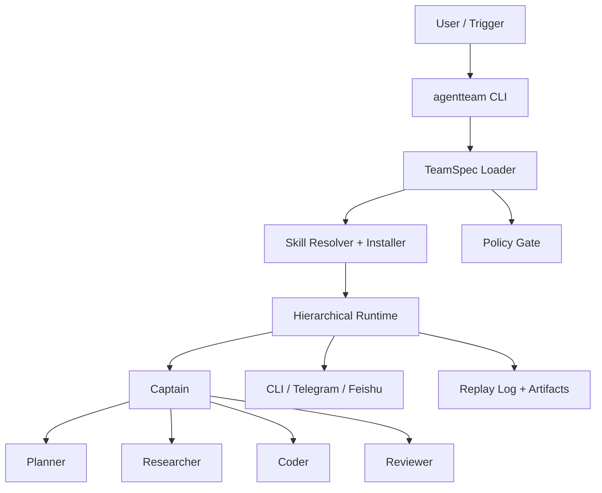

# agent-team-go

[](https://github.com/daewoochen/agent-team-go/actions/workflows/ci.yml)
[](./LICENSE)
[](./go.mod)
[](https://github.com/daewoochen/agent-team-go/stargazers)

Build and run AI-native agent teams in Go.

`agent-team-go` is a Go-first platform skeleton for teams of agents that can coordinate work, install the skills they need, and connect to real delivery channels like Feishu and Telegram.


[Chinese docs](./docs/zh-cn/README.md) · [Contributing](./CONTRIBUTING.md) · [Security](./SECURITY.md)

## Why this exists

Most agent frameworks stop at orchestration demos. Production teams need more:

- Structured delegation instead of prompt-only handoffs
- Custom skills with auto-install from local, registry, or git sources
- Channel adapters for Feishu, Telegram, and CLI-first workflows
- Replayable runs, artifacts, and event logs
- A clean Go codebase that is simple to deploy and extend

This repository is the first public release of that direction.

## Core promises

- `Custom Skills`: define your own skill packages and keep them versioned
- `Auto Skill Install`: missing skills are resolved and installed before a run
- `Feishu / Telegram Gateway`: channel adapters are first-class, not an afterthought
- `Structured Delegation`: captain, planner, researcher, coder, reviewer all work through typed work items
- `Replay Logs`: every run emits events and artifacts that can be replayed later

## Quick start

### 1. Run the example

```bash
git clone git@github.com:daewoochen/agent-team-go.git
cd agent-team-go
go run ./cmd/agentteam run \
  --team ./examples/software-team/team.yaml \
  --task "Launch the public MVP and de-risk the first release"
```

### 2. Validate channels

```bash
go run ./cmd/agentteam channels validate --team ./examples/software-team/team.yaml
```

### 3. Install a skill manually

```bash
go run ./cmd/agentteam skills install \
  --name github \
  --source local \
  --path ./skills/github
```

### 4. Bootstrap your own team

```bash
go run ./cmd/agentteam init --name my-team --dir ./demo
```

## What the MVP already does

- Parses a declarative `team.yaml`
- Validates channel configuration
- Ensures required skills are installed before a run
- Runs a hierarchical team loop with structured delegations
- Produces artifacts and a replay log under `.agentteam/runs/`

## Example architecture



## Typical launch-worthy scenarios

1. `Software Team`
   Captain coordinates Planner, Researcher, Coder, and Reviewer to ship a feature or release.
2. `Assistant Team`
   Coordinator receives incoming requests, routes them to specialists, and reports progress back to Feishu or Telegram.
3. `Ops Team`
   A captain agent validates channel access, installs missing skills, and assembles a safe execution plan.

## Why Go

- Single binary distribution
- Strong typing for specs, work items, and delegation contracts
- Great fit for concurrent run orchestration
- Friendly to platform teams that want predictable operations

## Why not another agent framework

This repo is intentionally opinionated:

- It starts from team execution, not just model orchestration
- It treats skills and channels as platform primitives
- It keeps the code small enough to learn, fork, and ship

## Roadmap

- `v0.1`: CLI, TeamSpec, skill resolver, local runtime, CLI channel
- `v0.2`: richer Telegram and Feishu adapters, stronger policy hooks
- `v0.3`: MCP bridge, better artifact handling, richer replay visualization
- `v0.4`: A2A bridge, sandbox execution, web console

## Repo layout

```text
cmd/agentteam          # CLI entrypoint
pkg/spec               # TeamSpec, AgentSpec, SkillManifest, channel config
pkg/runtime            # Run loop, delegation events, replay model
pkg/skills             # Skill resolver, installer, registry placeholder
pkg/channels           # CLI / Telegram / Feishu adapters
pkg/agents             # Role helpers
pkg/policy             # Download / install policy hooks
pkg/observe            # Replay log writer
examples/              # Runnable team templates
skills/                # Bundled skills
docs/                  # Extra documentation
```

## Current status

This is a polished MVP skeleton. It is meant to be runnable, readable, and easy to extend. The next step after the initial launch is to replace placeholder integrations with full production adapters while keeping the public interfaces stable.

## Contributing

Issues and pull requests are welcome. Good first contributions:

- richer skill manifests
- more realistic delegation strategies
- deeper Telegram / Feishu validation
- replay visualizers
- MCP and sandbox integrations

If this direction resonates with you, give the repo a star and share it with one builder who is tired of fragile agent demos.
